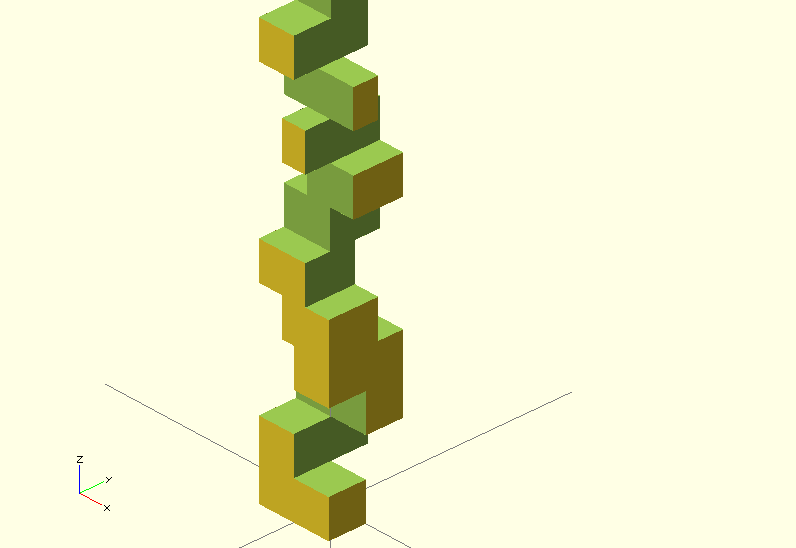
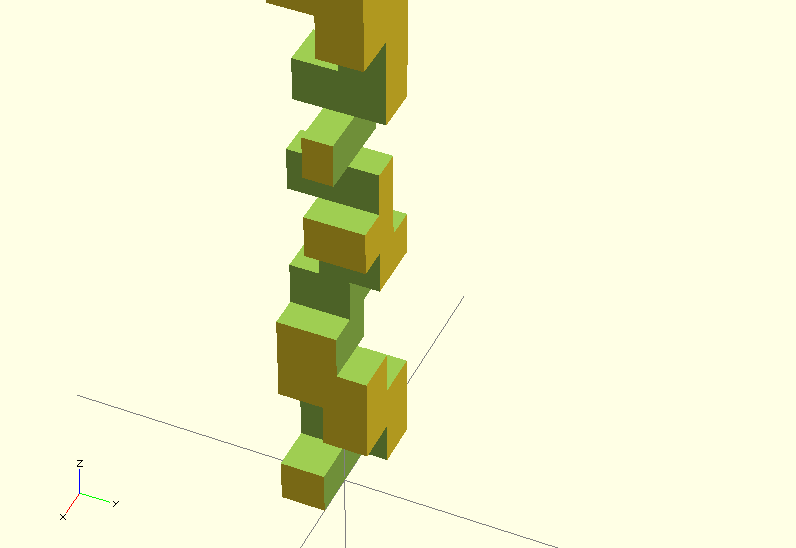

# Patterned wood planning

The project goal is to create a script to generate "interesting"
patterns to be cut into wood with a table saw in order to create
interesting stuff.

Problems to solve:

- how to generate "interesting" patterns
- how to make sure we only use sequences of patterns that
  would keep the piece strong enough
- how to keep the thing balanced

## Example outcome

